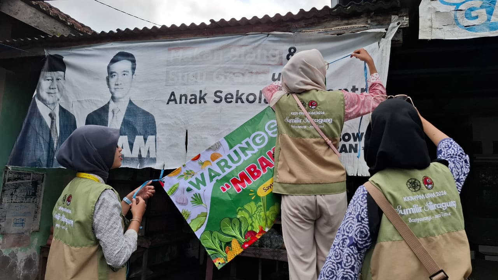

# 🌍 WebGIS UMKM Desa Barurejo

> **Peta Digital Interaktif Lokasi UMKM Desa Barurejo, Kecamatan Siliragung, Kabupaten Banyuwangi**

---

## 📋 Deskripsi

**WebGIS UMKM Desa Barurejo** adalah aplikasi pemetaan digital interaktif yang menampilkan lokasi Usaha Mikro, Kecil, dan Menengah (UMKM) di Desa Barurejo. Aplikasi ini dikembangkan sebagai bagian dari **Program KKN-PPM 2026** untuk mendukung promosi dan pengembangan ekonomi lokal.

---

## 🎯 Tujuan

- 🗺️ Memetakan lokasi UMKM di Desa Barurejo
- 📍 Menyediakan informasi detail setiap UMKM (produk, kontak, jam operasional)
- 🧭 Mempermudah navigasi menuju lokasi UMKM melalui Google Maps
- 📊 Mendukung promosi dan pengembangan ekonomi lokal
- 📱 Memberikan akses informasi UMKM secara digital

---

## ✨ Fitur Utama

| Fitur | Keterangan |
|-------|------------|
| 🗺️ **Peta Interaktif** | Menampilkan semua lokasi UMKM dengan marker berwarna sesuai kategori |
| 📍 **Informasi UMKM** | Detail produk, alamat, kontak, jam operasional, dan foto |
| 🧭 **Navigasi Google Maps** | Petunjuk arah langsung ke lokasi UMKM |
| 🔍 **Pencarian** | Cari UMKM berdasarkan nama, produk, atau kategori |
| 📊 **Statistik** | Data total UMKM, kategori, dan sebaran dusun |
| 📱 **Responsive** | Tampilan optimal di desktop, tablet, dan smartphone |
| 🏛️ **Layer Control** | Pilih basemap (OSM, Google Satellite, Terrain, Hybrid) |
| ✏️ **Tambah Data** | Tambah point, polyline, dan polygon langsung di peta |

---

## 🛠️ Teknologi

### Backend
- **Framework**: Laravel 11
- **Bahasa**: PHP 8.2
- **Database**: MySQL 8.0

### Frontend
- **HTML5, CSS3, JavaScript**
- **Bootstrap 5** - Styling responsive
- **Font Awesome 6** - Icons
- **Google Fonts (Poppins)** - Typography

### Peta & Geospasial
- **Leaflet.js** - Library peta interaktif
- **GeoJSON** - Format data spasial
- **Proj4js** - Proyeksi koordinat

### Library Tambahan
- **Leaflet Draw** - Menggambar di peta
- **Leaflet Geocoder** - Pencarian lokasi
- **Leaflet MiniMap** - Peta mini
- **Leaflet Routing Machine** - Navigasi rute

---

## 📁 Struktur Database

### Tabel `umkm`

| Field | Type | Keterangan |
|-------|------|------------|
| `id` | bigint(20) | Primary Key |
| `nama` | varchar(100) | Nama UMKM |
| `kategori` | varchar(50) | Kategori UMKM |
| `deskripsi` | text | Deskripsi produk |
| `alamat` | text | Alamat lengkap |
| `kontak` | varchar(20) | Nomor telepon |
| `jam_buka` | varchar(50) | Jam operasional |
| `produk` | json | Daftar produk |
| `foto` | varchar(255) | Foto UMKM |
| `latitude` | decimal(10,8) | Koordinat latitude |
| `longitude` | decimal(11,8) | Koordinat longitude |
| `google_maps_link` | varchar(255) | Link Google Maps |

---

## 🚀 Cara Install

### Prasyarat
- PHP >= 8.2
- Composer
- MySQL >= 8.0
- Node.js & NPM (opsional)
git clone https://github.com/sheryn-alya/KKN_Website-UMKM-Desa-Barurejo.git
cd KKN_Website-UMKM-Desa-Barurejo
